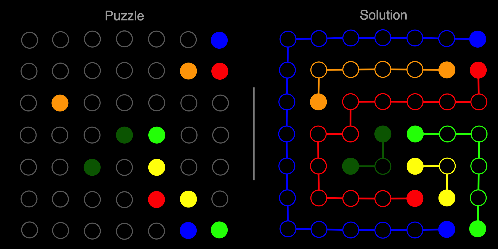

# Flow Free Solver In C With Deadend Elimination



## Table of Contens

- [Introduction](#introduction)
- [Features](#features)
- [Getting Started](#getting-started)
- [Usage](#usage)
- [Algorithm](#algorithm)

## Introduction

The Flow Free Solver is a C-based project tht aims to solve puzzles from the popular puzzle game **_Flow Free_** with dead-end detection mechanism.
The game consists of a grid with colored dots, and the goal is to connect each pair of dots with a path, ensuring that no paths intersect.
This solver can help you find solutions to Flow Free puzzles without a hassle.

## Features

- Solve Flow Free puzzles of various sizes and complexities.
- Generate and export the solved puzzle solution as SVG, showing the path between each pair of dots.

## Getting Started

### Prerequisites

To build and run the Flow Free Solver, you will need:

- C compiler (e.g., GCC)
- make (optional but recommended for building)

### Installation

- Clone the repository:

  ```bash
  git clone [repo-url]
  cd flow_free_solver_c
  ```

- Build the solver (executable files):

  ```bash
  make -B
  ```

- Destroy the solver and the produced solutions in SVG (if necessary):

  ```bash
  make clean
  ```

## Usage

To use the Flow Free Solver, follow these steps:

1. Compile and build the solver

  ```bash
  make -B
  ```

2. Run the solver with the Flow Free puzzle as an input in Unix terminal:

  ```bash
  ./flow -d -S ./puzzles_[puzzle-complexity]_[puzzle-size]_[puzzle-number].txt
  ```
  
  Replace 'puzzle-complexity', 'puzzle-size', and 'puzzle-number'
  
3. The solver will generate a solution in SVG, open the SVG file, copy it, and paste it on [SVG Viewer](https://www.svgviewer.dev/) for visualization.

## Algorithm

The Flow Free Solver uses Dijkstra's algorithm to explore possible paths on the puzzle grid. It aims to find a solution using a queue data structure by connecting dots without intersecting paths.
